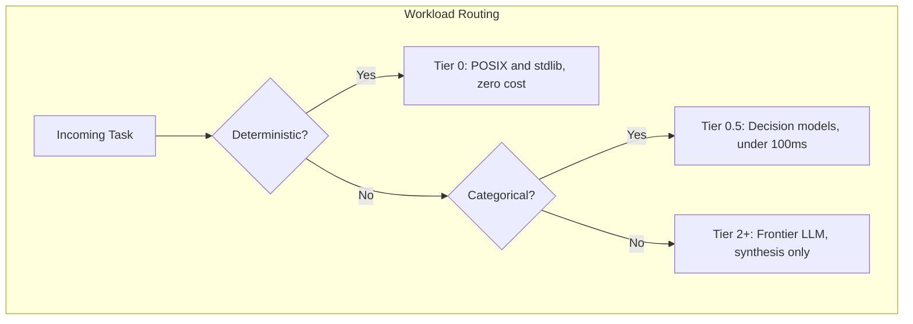

# Roderick Meadows

I design deterministic-first AI infrastructure. My thesis is simple: **use AI where it earns its cost, and use code where code wins.**

## Currently Building

**[determify](https://github.com/rodericklm1/determify)** is an MIT-licensed static scanner that audits agentic codebases for LLM misuse. It routes each workload to the cheapest correct execution tier instead of spending frontier-model tokens on work plain code finishes faster.

## The Three-Tier Doctrine

## Featured Work

| Project | What It Is |
| :--- | :--- |
| **determify** | Open-source deterministic triage scanner. MIT licensed, zero dependencies, CI-ready. |
| **Argus** | Multi-agent autonomous system on Google ADK with compute arbitration and pgvector state. |
| **Sentinel** | Headless agent harness with an ACID-compliant SQLite task queue and dual-tier memory. |
| **Aegis** | Autonomic AIDevSecOps loop wiring telemetry into tiered models and Ansible remediation. |
| **Cortex** | Sub-2B LLM fine-tuning pipeline using Unsloth QLoRA on local RTX 3090 hardware. |

## Writing and Research

- **Preprints:** 6 DOI-registered papers on enterprise architecture, socio-technical debt, and operations integrity
- **ORCID:** [0009-0002-1046-731X](https://orcid.org/0009-0002-1046-731X)

## Connect

[LinkedIn](https://www.linkedin.com/in/rodericklm) | [X](https://x.com/rodericklm) | [ORCID](https://orcid.org/0009-0002-1046-731X)

---

Background: 20.9 years USAF, Minuteman III ICBM systems maintenance. Zero-defect operations shaped how I build software: if it cannot hold precision under pressure, it is not ready for production.
